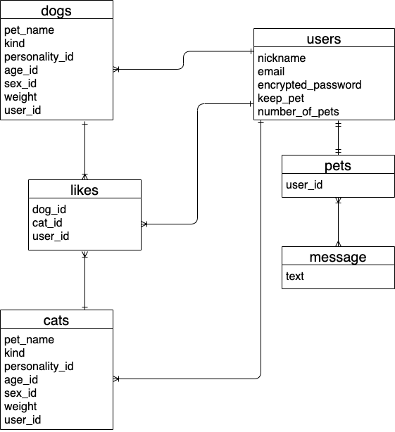

**アプリケーション名**: PetWith`(スマホ対応)`
    
    
**テストアカウント**: ログインアドレス:a@com  パスワード:aaaaaa
  
    

**アプリケーション概要**: 主に犬や猫が大好きな方へ向けた、画像投稿型の共有アプリ。
  
    

**URL**:http://35.73.72.206/
  
    

**ポートフォリオ(Googleスライド)**
https://docs.google.com/presentation/d/1c8aw_lUSpdtqgJjhrmYmEwHuFRlGPaGuJDHnkktn9K0/edit#slide=id.gc3f0e6038d_0_34
  
    

**利用方法**: 飼っているペット(犬、猫)の画像を投稿することができる。
            気に入った画像を投稿し、他人と画像の共有や、それを見て癒されることができる。
              
                

**[ポートフォリオの要件定義]**

**ストーリー(ユースケース)**:
20代から40代の犬や猫が大好きな男性、女性。
犬や猫を飼っている、または飼ってはいないが、いつかは飼いたい人。
  
    

**課題解決**:
周りがどんなペットを飼っているか気になる。
または飼い主でしか撮れないような写真を投稿して第三者に見てもらいたい。
自分の飼っているペットを自慢したい人。
ペットを見て癒されたい人。
このアプリケーションを通して、より犬や猫を好きになって欲しい。
  
    

**画像投稿機能**:
自身のお気に入りのペットの画像を共有し合う為の機能。
  
    

**ユーザーログイン機能**:
ユーザーの投稿した画像が一致しているかどうか、わかるようにする為の機能。
最低限必要な情報を入手する為の機能。
  
    

**画像の詳細機能**:
投稿した画像の情報を第三者が見れるようにする為の機能。
  
    

**画像の編集機能**:
違う画像を投稿してしまった時や、変更したい情報があった時に編集できるようにする為の機能。
  
    

**画像の削除機能**:
不要な投稿を消したい時に、投稿したユーザーのみが削除できるようにする為の機能。
  
    

**ユーザーのマイページ**:
ログイン時に記入したユーザーの個人情報が記載されているページ。
ユーザーの情報を知る為の機能。
画像の詳細からユーザーのページへ飛べるようにする為。
  
    

**チャット機能**:
匿名なので気軽に雑談や情報を提供できる機能。
  
    

**↓今後実装予定の機能↓**(アプリ未完成なので)
  

**いいね機能**:
良いと思った投稿画像にいいねが気軽に押せる為の機能。
  
    

**開発環境**:
Ruby(2.6.5), Ruby on Rails(6.0.3.5), JavaScript, JQuery, MySQL(5.6.50), Github, VScode, AWS(EC2)
  
    

**ER図**  
  
  

　　
  
    

# テーブル設計

## users テーブル

| Column             | Type       | Options                  |
| ------             | ------     | --------                 |
| nickname           | string     | null: false              |
| email              | string     | null: false, unique: true|
| encrypted_password | string     | null: false              |
| keep_pet           | string     | null: false              |
| number_of_pets     | string     | null: false              |

### Association

- has_many   :likes
- belongs_to :pet
- has_many   :cats
- has_many   :dogs
- has_many   :messages

## pets テーブル

| Column              | Type       | Options          |
| ------              | ------     | --------         |
| user                | references | foreign_key: true|

### Association

- belongs_to :user

##  dogsテーブル

| Column              | Type       | Options           |
| ------              | ---------- | --------          |
| pet_name            | string     | null: false       |
| kind                | string     | null: false       |
| personality_id      | integer    | null: false       |
| age_id              | integer    | null: false       |
| sex_id              | integer    | null: false       |
| weight              | string     | null: false       |
| user                | references | foreign_key: true |

### Association

- belongs_to :user

## cats テーブル

| Column              | Type       | Options           |
| ------              | ---------- | --------          |
| pet_name            | string     | null: false       |
| kind                | string     | null: false       |
| personality_id      | integer    | null: false       |
| age_id              | integer    | null: false       |
| sex_id              | integer    | null: false       |
| weight              | string     | null: false       |
| user                | references | foreign_key: true |

### Association

- belongs_to :user

##  likesテーブル

| Column          | Type       | Options           |
| ------          | ---------- | --------          |
| dogs            | references | foreign_key: true |
| cats            | references | foreign_key: true |
| user            | references | foreign_key: true |

### Association

- has_many :dogs
- has_many :cats
- has_many :users

##  messageテーブル

| Column       | Type       | Options           |
| ------       | ---------- | --------          |
| text         | text       | null: false       |

### Association

- has_many   :users
- belongs_to :pet